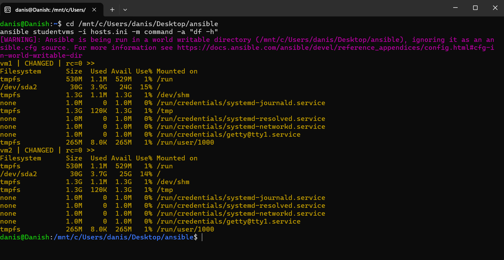

# Lab 43: Check Disk Usage on Multiple Remote VMs Using Ansible Ad-Hoc Commands

## 1. Objective
The purpose of this lab is to use Ansible ad-hoc commands to query, monitor, and inspect real-time disk storage and filesystem usage (`df -h`) simultaneously across multiple managed remote Linux nodes (`vm1` and `vm2`) without manually logging into each server via SSH.

---

## 2. Infrastructure Architecture & Lab Environment

| Node | Hostname / Label | IP Address | OS | SSH User | Role |
| :--- | :--- | :--- | :--- | :--- | :--- |
| **Control Node** | `Danish` (WSL) | Localhost | Ubuntu Linux | `danis` | Ansible Controller |
| **Managed Host 1** | `vm1` | `192.168.56.101` | Ubuntu Server | `danish` | Target Node 1 |
| **Managed Host 2** | `vm2` | `192.168.56.102` | Ubuntu Server | `danish` | Target Node 2 |

---

## 3. Inventory Configuration (`hosts.ini`)

The inventory file defines the target group `studentvms` containing both virtual machines:

```ini
[studentvms]
vm1 ansible_host=192.168.56.101 ansible_user=danish
vm2 ansible_host=192.168.56.102 ansible_user=danish

[all:vars]
ansible_python_interpreter=/usr/bin/python3
```

---

## 4. Commands Executed

### Step 1: Verify Host Connectivity
```bash
ansible studentvms -i hosts.ini -m ping
```

### Step 2: Query Disk Usage with `command` Module
```bash
ansible studentvms -i hosts.ini -m command -a "df -h"
```

*Command Breakdown:*
- `studentvms`: The target group defined in `hosts.ini`.
- `-i hosts.ini`: Specifies the inventory file path.
- `-m command`: Uses the core Ansible `command` module to execute binaries directly.
- `-a "df -h"`: Arguments passed to the module.
  - `-h`: Human-readable format (displays sizes in GB/MB instead of 1K-blocks).

---

## 5. Live Execution Output

```text
danis@Danish:/mnt/c/Users/danis/Desktop/ansible$ ansible studentvms -i hosts.ini -m command -a "df -h"
[WARNING]: Ansible is being run in a world writable directory (/mnt/c/Users/danis/Desktop/ansible), ignoring it as an ansible.cfg source.
vm1 | CHANGED | rc=0 >>
Filesystem      Size  Used Avail Use% Mounted on
tmpfs           530M  1.1M  529M   1% /run
/dev/sda2        30G  3.9G   24G  15% /
tmpfs           1.3G  1.1M  1.3G   1% /dev/shm
none            1.0M     0  1.0M   0% /run/credentials/systemd-journald.service
tmpfs           1.3G  120K  1.3G   1% /tmp
none            1.0M     0  1.0M   0% /run/credentials/systemd-resolved.service
none            1.0M     0  1.0M   0% /run/credentials/systemd-networkd.service
none            1.0M     0  1.0M   0% /run/credentials/getty@tty1.service
tmpfs           265M  8.0K  265M   1% /run/user/1000

vm2 | CHANGED | rc=0 >>
Filesystem      Size  Used Avail Use% Mounted on
tmpfs           530M  1.1M  529M   1% /run
/dev/sda2        30G  3.7G   25G  14% /
tmpfs           1.3G  1.1M  1.3G   1% /dev/shm
tmpfs           1.3G  236K  1.3G   1% /tmp
none            1.0M     0  1.0M   0% /run/credentials/systemd-journald.service
none            1.0M     0  1.0M   0% /run/credentials/systemd-resolved.service
none            1.0M     0  1.0M   0% /run/credentials/systemd-networkd.service
none            1.0M     0  1.0M   0% /run/credentials/getty@tty1.service
tmpfs           265M  8.0K  265M   1% /run/user/1000
```

---

## 6. Output Analysis & Key Findings

1. **Root Partition (`/`)**:
   - `vm1`: Total 30G, Used 3.9G, Available 24G (**15% capacity utilized**).
   - `vm2`: Total 30G, Used 3.7G, Available 25G (**14% capacity utilized**).
2. **Execution Return Code (`rc=0`)**: Both tasks exited cleanly with return code `0`, proving successful remote command execution.
3. **Parallel Execution**: Both nodes were queried concurrently, demonstrating the time-saving advantage of Ansible over manual SSH logins.

---

## 7. Verification Screenshot



---

## 8. Conclusion
Ansible ad-hoc commands provide system administrators with instant visibility across multi-node infrastructure. Checking storage with `command -a "df -h"` ensures proactive disk monitoring before disk space exhaustion affects production services.
