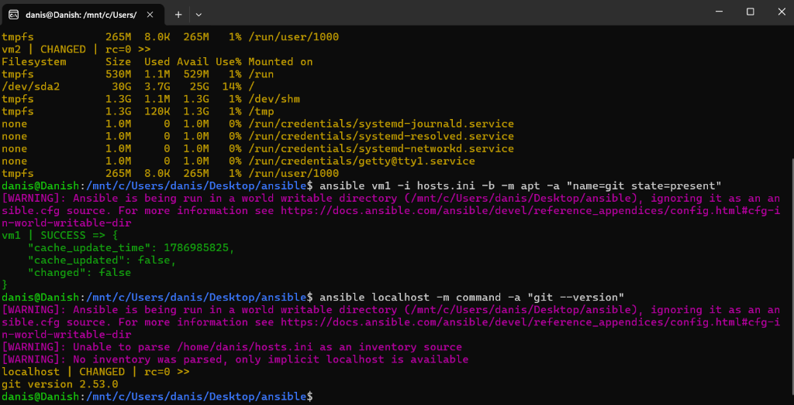

# Lab 44: Install Git on Remote Linux VMs Using Ansible Ad-Hoc Commands

## 1. Objective
The objective of this lab is to use Ansible ad-hoc commands with privilege escalation (`-b`) and the `apt` package manager module (`-m apt`) to ensure `git` is installed and up-to-date across managed nodes (`vm1`) and the local controller node (`localhost`), demonstrating Ansible idempotency and targeted node execution.

---

## 2. Infrastructure & Environment Setup

| Host | IP Address | OS | SSH User | Role |
| :--- | :--- | :--- | :--- | :--- |
| **Control Node (`localhost`)** | Localhost | Ubuntu Linux (WSL) | `danis` | Ansible Controller |
| **Managed Host 1 (`vm1`)** | `192.168.56.101` | Ubuntu Server | `danish` | Target Node 1 |

---

## 3. Command Anatomy & Flag Breakdown

```bash
ansible vm1 -i hosts.ini -b -m apt -a "name=git state=present"
```

| Flag | Parameter | Function | Explanation |
| :---: | :---: | :--- | :--- |
| **Host** | `vm1` | Target Host | Limits execution exclusively to `vm1` instead of the whole group. |
| **`-i`** | `hosts.ini` | Inventory Source | Specifies the inventory file defining remote IP addresses and users. |
| **`-b`** | *N/A* | Become (`sudo`) | Grants root privilege escalation required to install system packages. |
| **`-m`** | `apt` | Module | Utilizes Ansible’s dedicated Debian/Ubuntu package management module. |
| **`-a`** | `"name=git state=present"` | Arguments | Instructs the `apt` module to verify `git` package presence. |

---

## 4. Commands Executed

### Step 1: Install Git on Target VM (`vm1`)
```bash
ansible vm1 -i hosts.ini -b -m apt -a "name=git state=present"
```

### Step 2: Verify Git Version on Localhost (Controller)
```bash
ansible localhost -m command -a "git --version"
```

### Step 3: Verify Git Version on Remote VM (`vm1`)
```bash
ansible vm1 -i hosts.ini -m command -a "git --version"
```

---

## 5. Live Execution Output

```text
danis@Danish:/mnt/c/Users/danis/Desktop/ansible$ ansible vm1 -i hosts.ini -b -m apt -a "name=git state=present"
[WARNING]: Ansible is being run in a world writable directory (/mnt/c/Users/danis/Desktop/ansible), ignoring it as an ansible.cfg source.
vm1 | SUCCESS => {
    "cache_update_time": 1786985825,
    "cache_updated": false,
    "changed": false
}

danis@Danish:/mnt/c/Users/danis/Desktop/ansible$ ansible localhost -m command -a "git --version"
[WARNING]: Ansible is being run in a world writable directory (/mnt/c/Users/danis/Desktop/ansible), ignoring it as an ansible.cfg source.
[WARNING]: Unable to parse /home/danis/hosts.ini as an inventory source
[WARNING]: No inventory was parsed, only implicit localhost is available
localhost | CHANGED | rc=0 >>
git version 2.53.0
```

---

## 6. Key Learnings & Observations

1. **Idempotency Demonstrated (`changed: false`)**:
   - Because `git` was already installed on `vm1`, Ansible recognized that the desired state (`state=present`) was already satisfied.
   - It returned `changed: false` with return code `SUCCESS`, making the operation safe to re-run indefinitely without altering system state unnecessarily.
2. **Privilege Escalation (`-b`)**:
   - Package operations (`apt install`) modify system directories (`/usr/bin`, `/var/lib/dpkg/`). Without the `-b` (`become`) flag, the task would fail with a permission denied error.
3. **Localhost Targeting**:
   - Ansible can seamlessly manage and inspect the local controller node by specifying `localhost`, allowing unified automation across both remote infrastructure and local development machines.

---

## 7. Verification Screenshot



---

## 8. Conclusion
Using the `apt` module via Ansible ad-hoc commands ensures consistent, repeatable package management across multi-VM fleets, guaranteeing package availability with zero configuration drift.
