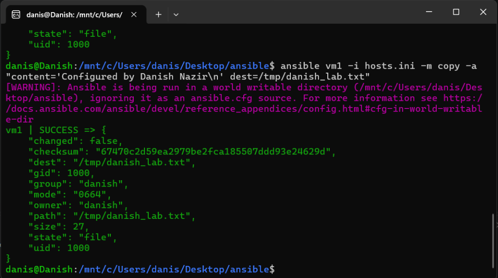

# Lab 45: Copy Files to Remote Linux VMs Using Ansible Ad-Hoc Commands

## 1. Objective
The objective of this lab is to use Ansible ad-hoc commands with the `copy` module (`-m copy`) to transfer files from the local Ansible Control Node (WSL) to multiple remote managed Linux nodes (`vm1` and `vm2`). We will verify file delivery using the `command` module (`cat`), analyze JSON return attributes, and demonstrate Ansible's core principle of **idempotency**.

---

## 2. Infrastructure & Environment Setup

| Host | IP Address | OS | SSH User | Role |
| :--- | :--- | :--- | :--- | :--- |
| **Control Node (`localhost`)** | `127.0.0.1` | Ubuntu Linux (WSL) | `danis` | Ansible Controller |
| **Managed Host 1 (`vm1`)** | `192.168.56.101` | Ubuntu Server | `danish` | Target Managed Node 1 |
| **Managed Host 2 (`vm2`)** | `192.168.56.102` | Ubuntu Server | `danish` | Target Managed Node 2 |

---

## 3. Command Anatomy & Flag Breakdown

```bash
ansible studentvms -i hosts.ini -m copy -a "src=test-file.txt dest=/tmp/test-file.txt"
```

| Component | Flag / Argument | Purpose & Description |
| :--- | :---: | :--- |
| **Target Group** | `studentvms` | Specifies the target host group in the inventory containing both `vm1` and `vm2`. |
| **Inventory** | `-i hosts.ini` | Tells Ansible where to find the inventory file defining remote IP addresses and users. |
| **Module** | `-m copy` | Calls Ansible's built-in `copy` module for transferring files from the control node to managed nodes. |
| **Arguments** | `-a "src=... dest=..."` | Passes parameter key-value pairs to the module: <br>• `src`: Path to source file on the controller machine.<br>• `dest`: Absolute destination path on the remote hosts. |

---

## 4. Commands Executed

### Step 1: Create the Source File on Control Node
```bash
echo "Hello from Danish Ansible Control Node - Lab 45" > test-file.txt
```

### Step 2: Transfer File to Remote VMs via Ad-Hoc Copy
```bash
ansible studentvms -i hosts.ini -m copy -a "src=test-file.txt dest=/tmp/test-file.txt"
```

### Step 3: Verify File Delivery & Contents on Both Remote VMs
```bash
ansible studentvms -i hosts.ini -m command -a "cat /tmp/test-file.txt"
```

### Step 4: Re-run the Copy Command (Demonstrating Idempotency)
```bash
ansible studentvms -i hosts.ini -m copy -a "src=test-file.txt dest=/tmp/test-file.txt"
```

---

## 5. Live Execution Output

### 1. File Transfer Execution (`copy` module)
```json
danis@Danish:/mnt/c/Users/danis/Desktop/ansible$ ansible studentvms -i hosts.ini -m copy -a "src=test-file.txt dest=/tmp/test-file.txt"
[WARNING]: Ansible is being run in a world writable directory (/mnt/c/Users/danis/Desktop/ansible), ignoring it as an ansible.cfg source.
vm1 | CHANGED => {
    "changed": true,
    "checksum": "fabfc6a8f47d5d2599e1e36782b6f4ca730b4dfe",
    "dest": "/tmp/test-file.txt",
    "gid": 1000,
    "group": "danish",
    "md5sum": "027da37a3ff56f37d695c14ccde96add",
    "mode": "0664",
    "owner": "danish",
    "size": 48,
    "src": "/home/danish/.ansible/tmp/ansible-tmp-1788939283.2386134-3042-203025979455564/.source.txt",
    "state": "file",
    "uid": 1000
}
vm2 | CHANGED => {
    "changed": true,
    "checksum": "fabfc6a8f47d5d2599e1e36782b6f4ca730b4dfe",
    "dest": "/tmp/test-file.txt",
    "gid": 1000,
    "group": "danish",
    "md5sum": "027da37a3ff56f37d695c14ccde96add",
    "mode": "0664",
    "owner": "danish",
    "size": 48,
    "src": "/home/danish/.ansible/tmp/ansible-tmp-1788939284.7738037-3043-179174779251040/.source.txt",
    "state": "file",
    "uid": 1000
}
```

### 2. Content Verification (`command` module with `cat`)
```text
danis@Danish:/mnt/c/Users/danis/Desktop/ansible$ ansible studentvms -i hosts.ini -m command -a "cat /tmp/test-file.txt"
[WARNING]: Ansible is being run in a world writable directory (/mnt/c/Users/danis/Desktop/ansible), ignoring it as an ansible.cfg source.
vm1 | CHANGED | rc=0 >>
Hello from Danish Ansible Control Node - Lab 45

vm2 | CHANGED | rc=0 >>
Hello from Danish Ansible Control Node - Lab 45
```

---

## 6. Understanding the Output & Concepts

### Key JSON Return Attributes:
1. `"changed": true`: Ansible detected that the destination file did not exist or had different content, so it wrote the new file to disk.
2. `"checksum"` & `"md5sum"`: Cryptographic hash computed by Ansible to compare local vs. remote file contents.
3. `"mode": "0664"`: Standard Linux permissions (read/write for owner and group, read-only for others).
4. `"rc": 0`: Return code 0 indicates the remote `cat` command executed successfully.

### What is Idempotency in the `copy` module?
- If you re-run the exact same `ansible ... -m copy` command without modifying `test-file.txt`, Ansible calculates the MD5/SHA checksums and sees they match.
- Result: `"changed": false` and status `SUCCESS` (Green). Ansible safely does nothing, avoiding redundant disk writes and network payload transfers.

---

## 7. Screenshot Evidence



---

## 8. Summary & Key Takeaways
- The `copy` module securely transfers files over SSH using SFTP/SCP mechanisms built into Ansible.
- Arguments require `src` (controller source) and `dest` (remote destination path).
- Optional parameters include `mode` (e.g., `mode='0644'`), `owner` (`owner=danish`), and `backup` (`backup=yes`).
- Ad-hoc copy commands are great for quick configuration file pushes, while Ansible Playbooks are preferred for managing full application configurations and deployments.
