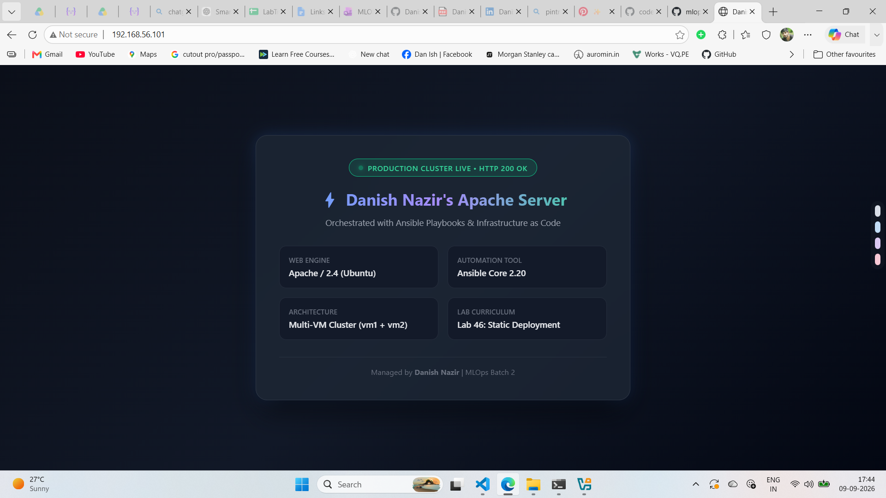
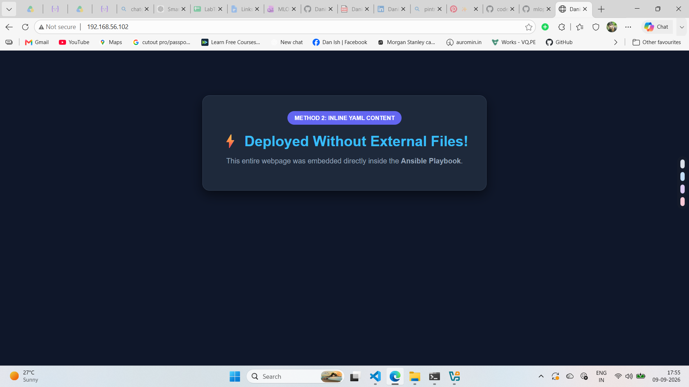

# Lab 46: Setup Static Website with Apache Using Ansible Playbook

## 1. Objective
The objective of this lab is to transition from Ansible ad-hoc commands to full **Ansible Playbooks (`.yml`)**. We automate the end-to-end deployment of an **Apache Web Server (`apache2`)** across managed Linux virtual machines (`vm1` and `vm2`), configure automatic service startup on boot, deploy custom HTML landing pages using two distinct methods (**Way 1: External Source File** and **Way 2: Inline YAML Content**), and verify live HTTP traffic.

---

## 2. Infrastructure & Environment Setup

| Host | IP Address | OS | SSH User | Role |
| :--- | :--- | :--- | :--- | :--- |
| **Control Node (`localhost`)** | `127.0.0.1` | Ubuntu Linux (WSL) | `danis` | Ansible Controller |
| **Managed Host 1 (`vm1`)** | `192.168.56.101` | Ubuntu Server | `danish` | Web Server Target 1 |
| **Managed Host 2 (`vm2`)** | `192.168.56.102` | Ubuntu Server | `danish` | Web Server Target 2 |

---

## 3. Playbook Architecture & Core YAML Rules

Every Ansible playbook adheres to strict YAML standards:
1. **Document Start**: Must begin with three dashes (`---`).
2. **Indentation**: Standard 2 spaces per hierarchy level (no `Tab` characters).
3. **List Denotation**: Hyphen followed by a space (`- `).
4. **Key-Value Pairs**: Colons must always be followed by a space (`key: value`). Task names containing colons must be enclosed in quotes (`"..."`).

### Playbook Tasks Breakdown:
* **`apt` module**: Installs the `apache2` package with `update_cache: yes`.
* **`copy` module**: Deploys the HTML website to `/var/www/html/index.html` with permissions `0644` and owner `www-data:www-data`.
* **`service` module**: Ensures the Apache daemon is in `state: started` and `enabled: yes` across system reboots.
* **`become: yes`**: Grants necessary `sudo/root` privileges for system administration.

---

## 4. Playbook Code (`46-setup-static-website-apache.yml`)

```yaml
---
- name: Install apache with custom website playbook
  hosts: studentvms
  become: yes

  tasks:
    - name: Ensure apache2 is present
      apt:
        name: apache2
        state: present
        update_cache: yes

    - name: "Deploy custom index.html page inline"
      copy:
        content: |
          <!DOCTYPE html>
          <html lang="en">
          <head>
              <meta charset="UTF-8">
              <title>Danish Nazir - DevOps Lab 46 (Method 2 Inline)</title>
              <style>
                  body {
                      font-family: Arial, sans-serif;
                      background: #0f172a;
                      color: #f8fafc;
                      text-align: center;
                      margin-top: 100px;
                  }
                  .card {
                      background: #1e293b;
                      border: 1px solid #334155;
                      border-radius: 16px;
                      padding: 40px;
                      display: inline-block;
                      box-shadow: 0 10px 25px rgba(0,0,0,0.5);
                  }
                  .badge {
                      background: #6366f1;
                      color: white;
                      padding: 8px 16px;
                      border-radius: 20px;
                      font-weight: bold;
                      font-size: 13px;
                  }
                  h1 {
                      color: #38bdf8;
                      margin: 20px 0 10px 0;
                  }
                  p {
                      color: #94a3b8;
                      font-size: 16px;
                  }
              </style>
          </head>
          <body>
              <div class="card">
                  <span class="badge">METHOD 2: INLINE YAML CONTENT</span>
                  <h1>⚡ Deployed Without External Files!</h1>
                  <p>This entire webpage was embedded directly inside the <strong>Ansible Playbook</strong>.</p>
              </div>
          </body>
          </html>
        dest: /var/www/html/index.html
        owner: www-data
        group: www-data
        mode: '0644'

    - name: Ensure Apache is running and enabled
      service:
        name: apache2
        state: started
        enabled: yes
```

---

## 5. Execution & Verification

### Playbook Execution Command:
```bash
ansible-playbook -i hosts.ini 46-setup-static-website-apache.yml
```

### Execution Output:
```text
PLAY [Install apache with custom website playbook] ***************************************

TASK [Gathering Facts] *******************************************************************
ok: [vm1]
ok: [vm2]

TASK [Ensure apache2 is present] *********************************************************
ok: [vm2]
ok: [vm1]

TASK [Deploy custom index.html page inline] **********************************************
changed: [vm2]
changed: [vm1]

TASK [Ensure Apache is running and enabled] **********************************************
ok: [vm2]
ok: [vm1]

PLAY RECAP *******************************************************************************
vm1                        : ok=4    changed=1    unreachable=0    failed=0    skipped=0    rescued=0    ignored=0
vm2                        : ok=4    changed=1    unreachable=0    failed=0    skipped=0    rescued=0    ignored=0
```

---

## 6. Live Evidence & Screenshots

### Method 1: Production Dashboard Deployment (`src: ./index.html`)


### Method 2: Standalone Inline Deployment (`content: |`)


---

## 7. Key Takeaways
- **Playbooks vs. Ad-Hoc**: Playbooks encapsulate complex, multi-task workflows into version-controlled, reusable infrastructure declarations.
- **Idempotency**: Running the playbook multiple times results in `changed=0`, ensuring safe and predictable re-execution.
- **Deployment Strategies**:
  - `src`: Ideal for team collaboration where frontend code is maintained independently from Ansible code.
  - `content`: Ideal for self-contained orchestration and configuration templates with zero external dependencies.
